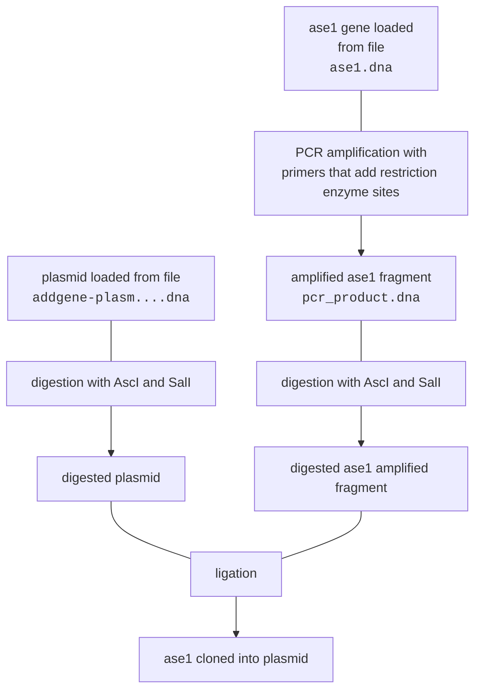

# Extracting history from snapgene files

## What the function should do

Ideally, we should have a way to read this history from `final_plasmid.dna`, like SnapGene does, and convert into json (`history.json`).

## Minimal example

In this folder you can find files for the history of a typical cloning strategy:



You can see it in the SnapGene history of `final_plasmid.dna` if you open with snapgene viewer (below the image saved as svg).


The equivalent history is built with ShareYourCloning with the script `build_history.py`, and stored as json in `history.json`. The only difference in this case is that ase1 is loaded directly from GenBank instead of loaded from a file (I actually loaded from GenBank with SnapGene, but it does not register this in the history).

## Old SnapGene files

The history could be extracted from the file that @nicolazilio shared with me as xml using the code in `extract_snapgene_history.py`

```python
from Bio.SeqIO.SnapGeneIO import _iterate

snapgene_string = ''

with open("final_plasmid.dna", "rb") as in_handle:
    for i in _iterate(in_handle):
        try:
            snapgene_string += i[2].decode("utf-8")
        except UnicodeDecodeError:
            pass

with open("final_plasmid_history.xml", "w") as out_handle:
    out_handle.write(snapgene_string)
```

Running the code would produce an xml section with the tag `<HistoryTree>`, where the information could be found (not only the info about cloning steps, but also the parent sequences were stored). Perhaps @nicolazilio can do this same cloning with the old SnapGene version, and with that we could start adding support for old snapgene files. I suppose a lot of people still have a lot of those, so it would be good.

## New SnapGene files

Running the same code on new SnapGene files (such as `final_plasmid.dna`) does not give this xml code anymore, they must now record it in a different way so that it cannot be read. Quite sad if that is the reason...

I can't really think of a way of extracting this information. Tried to open the files in Hex viewers with no luck, and I am not familiar with this kind of task.

I thought maybe using the history exported as svg could be a possibility, but the problem there is that the Primers are not shown in the svg, so it would not work (see `trim_svg.py` and `trimmed_svg.svg` where I have extracted all text tags from the svg).

I cannot access the new version of SnapGene right now, but it would be good to know if it is possible to export sequences in older formats so that they are compatible with older clients, but I doubt it.

## Conclusion

If you want to, I think it would still be worth to support importing history from SnapGene files in the old format. There are probably plenty of those around. Also, if this json format ever becomes broadly used and some people cannot read the history in their files, they may put some pressure on SnapGene to make the information readable?


